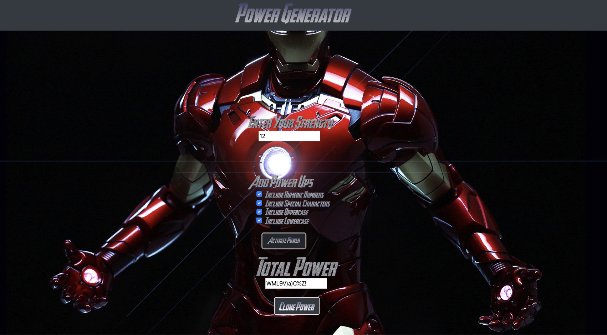

# 03-pwGenerator Iron man hw-3

Iron Man Password/Power generator Homework Assignment 3
Site link https://bowdwin.github.io/02-bootstrapportfolio/
## About / Synopsis

* This is our 3rd homework assignement. It's a password generator that takes anywhere from 8-128 characters and randonly generates a password bassed off what you selected for checkboxes
* It will send variouse popups if no Power Ups are selected or if strength is not between 8-128
* Project status: working/prototype

## Screen shot of "Books"

## Image links
Images referenced from the following 
* Background image  http://getwallpapers.com/collection/iron-man-suit-wallpapers

